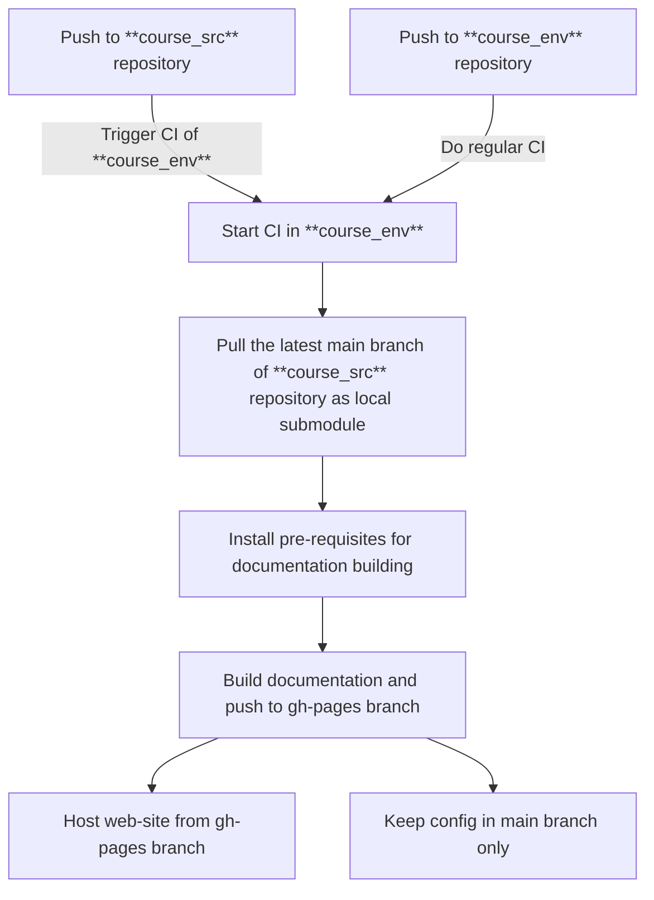
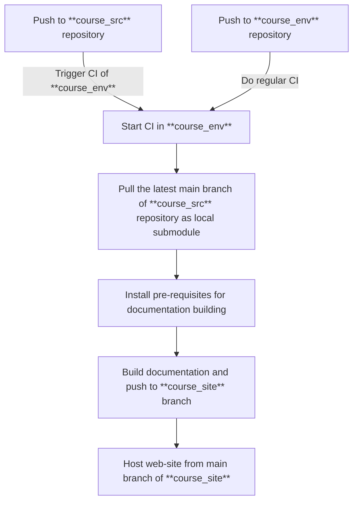

# Publishing to GitLab or GitHub

While there is official [documetation](https://squidfunk.github.io/mkdocs-material/publishing-your-site), it focuses mostly on hosting web-site when the built web-site is in the same repository as the cofig files. 

In scope of this examples, such set-up would be called `mono-repository`, and example of such project could be [Digital Garden](https://github.com/jobindjohn/obsidian-publish-mkdocs/tree/main) project.

However, you might want to separate configuration repository and raw notes, having those in separate repositories. Than you will need to  configure, what in scope of this notes would be called `multi-repository`, either as 2 or 3 repositories. 

### 2-repository config

THis will be usefull to seprate creation part and configuration/hosting part of such projects.

### 3-repository config

This would be an overkill, when you want to keep in secret both raw notes, configuration repository and having only public web-site.

Regardless, we'll try to cover each scenario.

## Hosting Platforms

Free alternative hostings for static pages for personal use:

- [GitLab Pages](https://about.gitlab.com/pricing/)
- [GitHub Pages](https://pages.github.com/)
- [CloudFlare Pages](https://pages.cloudflare.com/)

[Documetation](https://squidfunk.github.io/mkdocs-material/publishing-your-site) also refers to instructions for other hosters:

- [DigitalOcean](https://deborahwrites.com/guides/deploy-host-mkdocs/deploy-mkdocs-material-digitalocean-app-platform/)
- [Fly.io](https://documentation.breadnet.co.uk/cloud/fly/mkdocs-on-fly/)
- [Netlify](https://deborahwrites.com/guides/deploy-host-mkdocs/deploy-mkdocs-material-netlify/)
- [Vercel](https://deborahwrites.com/guides/deploy-host-mkdocs/deploy-mkdocs-material-vercel/)
- [Scaleway](https://www.scaleway.com/en/docs/tutorials/using-bucket-website-with-mkdocs/)
