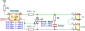
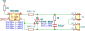

# Post Processing

Since the main purpose of the repo is to have technical notes with some included schematics it is nice to have schematics stored within the repository, but being processed into `svg` at the publishing stage.

To make it automatic I use templates of each topic/chapter. Now, for automation our script can run through the `docs` or `docs/content` folder of repository, check each subfolder for images to be created and create nice SVG illustrations from it.

As post-processing the Python is chosen since it can be run cross-platform.

In the root folder of the project, create the folder `.scripts` (or other name) and sub-folder `local_repo` with file `__init__.py` in it.
The folder `.scripts` will contain all scripts that do actual task, the file `local_repo/__init__.py` will contain all variables that are common for all projects.


```python title="local_repo/__init__.py"
import os, sys, subprocess
import logging

content_folder_name = "docs"
images_folder_name = "images"
images_src_folder_name = "src"
images_render_folder_name = "render"
images_software_folder_name = "kicad"

project_root_folder = os.path.dirname(os.path.dirname(os.path.dirname(__file__)))
content_folder = os.path.join(project_root_folder, content_folder_name)
src_folder_postfix = os.path.join(images_folder_name, images_src_folder_name, images_software_folder_name)
target_folder_postfix = os.path.join(images_folder_name, images_render_folder_name, images_software_folder_name)
```

```python title="render_kicad.py"
import os, sys, subprocess
import logging
import re
import platform

from local_repo import project_root_folder, content_folder, src_folder_postfix, target_folder_postfix


match platform.system():
	case 'Windows':
		kicad_cli = r'C:\Program Files\KiCad\9.0\bin\kicad-cli.exe'
		inkscape = r'C:\Program Files\Inkscape\bin\inkscape.exe'
	case 'Darwin':
		kicad_cli = r'/Applications/KiCad/KiCad.app/Contents/MacOS/kicad-cli'
		inkscape = r'/Applications/Inkscape.app/Contents/MacOS/inkscape'
	case 'Linux':
		kicad_cli=r'kicad-cli'
		inkscape=r'inkscape'

extensions = ['kicad_sch']

replacements = [
	# description tags 
    (r'<desc\s[^>]*>[\s\S]*?</desc>', ''),
    # definitions tags
    (r'<defs[^\n]*\n[^>]*?/>', ''),
    # template of title, generated by KiCAD
    (r'(<title\s+id="[^"]*">)(?:SVG Image created as )?(.*?)(?:\.svg.*?)</title>', r'\1\2</title>')
]

def kicad_to_svg(target_folder, src_file):
	subprocess.call([kicad_cli,'sch','export','svg','--output', target_folder,'--exclude-drawing-sheet', '--no-background-color', src_file])

def postprocess_svg (render_file_name):
	# cropping according to content without fields
	subprocess.call([inkscape,'--export-plain-svg','--export-text-to-path','--export-area-drawing','--export-background-opacity=255', '--export-overwrite', render_file_name])

	# replacing some identifiers to decrease the amount of diffs during git commits
	with open(render_file_name, 'r', encoding="utf-8") as file:
		svg_content = file.read()
		for replacement in replacements:
			svg_content = re.sub(replacement[0], replacement[1],  svg_content, flags = re.M)

	with open(render_file_name, 'w', encoding="utf-8") as file:
		# encoding is IMPORTANT if non-English symbols are involved
		file.write(svg_content)


if __name__ == "__main__":
	logger = logging.getLogger(__name__)
	logging.basicConfig(format='%(asctime)s %(message)s', level=logging.INFO)

	logger.info(f"Detected project root folder:\n\t{project_root_folder}")
	logger.info(f"Looking for KiCAD schematics in folder:\n\t{content_folder}")

	logger.info(f"Used source folder postfix:\n\t{src_folder_postfix}")
	logger.info(f"Used source target postfix:\n\t{target_folder_postfix}")

	for root, dirs, files in os.walk(content_folder):
		for file in files:
			if any(file.lower().endswith(extension.lower()) for extension in extensions):
				src_file = os.path.join(root, file)
				render_file_name = os.path.splitext(file)[0]+'.svg'

				target_folder = root.replace(src_folder_postfix, target_folder_postfix)
				render_file = os.path.join(target_folder, render_file_name)
				
				os.makedirs(target_folder, exist_ok=True)

				logger.info(f"Exporting schematics:\n\t{src_file}")
				kicad_to_svg(target_folder, src_file)
				logger.info(f"Post-processing file :\n\t{render_file}")
				postprocess_svg(render_file)
```

Those are example, for the actual state, refer to the content of `.scripts` of this repository.

As of now, Inkscape does not allow to add 5mm margin per each side of the drawing, but there might be a [way around](https://graphicdesign.stackexchange.com/questions/25066/inkscape-padding-or-margin-on-export) it.

## Compressing SVG

For smaller svg files, consider additionally compressing them at the point of creation.

use `scour` library of python (add it to `prerequisite.txt`).

For example , create in the `.scripts` folder subfolder `svg_compressor` with `__init__.py` file of the following content:

```python title=".scripts/svg_compressor/__init__.py"
import os
import logging 
from scour import scour

logging.basicConfig(
    level=logging.INFO,
    format='%(asctime)s - %(name)s - %(levelname)s - %(message)s'
)

logger = logging.getLogger('svg_compressor')

def compress_svg(input_file, output_file=None):

    options = scour.generateDefaultOptions()
    
    # High compression settings
    options.strip_comments = True
    options.strip_xml_prolog = True
    options.remove_metadata = True
    options.enable_viewboxing = True
    options.indent_type = 'none'
    #options.digits = 3
    options.simplify_colors = True
    options.remove_descriptive_elements = True
    options.strip_ids = True
    options.shorten_ids = True
    options.enable_id_stripping = True
    options.newlines = False
    
    # Read the input file
    with open(input_file, 'r') as f:
        svg_raw_data = f.read()

    original_size = len(svg_raw_data)
    
    # Compress the SVG
    compressed_svg = scour.scourString(svg_raw_data, options)
        
    # Calculate size reduction percentage
    reduction_delta = (original_size - len(compressed_svg))
    reduction_ratio = reduction_delta / original_size * 100

    logger.info(f"Space saving:\n\t {reduction_delta} bytes, {reduction_ratio:.2f}%")
    
    # Determine output path
    if output_file is None:
        output_file = input_file
        logger.info("No output file specified, will overwrite input file")
    
    # Write the compressed SVG
    with open(output_file, 'w') as f:
        f.write(compressed_svg)
```

No, we can compress the SVG files exported from KiCAD. by adding following lines to kicad processing script:

```python
	# This is already there:
	# logger.info(f"Post-processing file :\n\t{render_file}")
	# postprocess_svg(render_file)
	
	# Add this
	logger.info(f"Compressing file :\n\t{render_file}")
	svg_compressor.compress_svg(render_file)
```

And don't forget to import out compressor:

```python
import svg_compressor
```

For Example:

| Original, cropped                                 | Compressed                                               |
| ------------------------------------------------- | -------------------------------------------------------- |
|  |  |

Visually, there is no difference, but size-wise. compressed image is 139419 bytes (38.69%) smaller than un-compressed.
## Versions remark and installation

As of now, the actual versions are:

- KiCad 9.0.0 
- Inkscape 1.4.0

To install them both on Ubuntu 24.04 LTS from under WSL

```bash
sudo apt update
sudo add-apt-repository --yes ppa:kicad/kicad-9.0-releases
sudo apt install --install-recommends kicad -y
sudo apt full-upgrade -y
sudo apt install inkscape -y
```

Don't forget to adjust the `.gitignore` to drop some intermediate python files aswell as kicad back-up folders and archives. 
